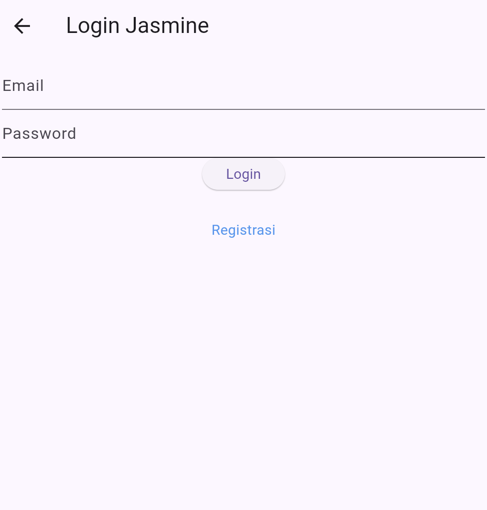

###Aplikasi CRUD Flutter TokoKita
Aplikasi ini adalah hasil latihan implementasi CRUD (Create, Read, Update, Delete) dengan menggunakan Flutter. Fitur utama aplikasi meliputi proses registrasi, login, penambahan produk, pengeditan produk, penghapusan produk, dan melihat daftar produk. Setiap fungsionalitas tersebut didukung dengan tampilan antarmuka yang sederhana namun efektif, memudahkan pengguna untuk berinteraksi dengan data produk. Semua proses dijelaskan secara detail mulai dari input data hingga output yang dihasilkan.

1. Proses Login
   Proses login terdiri dari dua langkah utama: pengguna menginputkan email dan password yang telah didaftarkan, kemudian sistem akan memvalidasi data tersebut. Jika validasi berhasil, pengguna diarahkan ke halaman produk; jika gagal, pesan error ditampilkan. Berikut ini adalah langkah-langkah detail beserta kode terkait.
2. Proses CRUD Produk
      a. Tambah Produk
      Pengguna dapat menambah produk baru dengan mengisi form yang tersedia. Setiap input, seperti kode, nama, harga produk, akan disimpan dalam database.
      b. Ubah Produk
      Pada fitur ini, pengguna dapat memilih produk dari daftar yang ada untuk diedit. Setelah melakukan perubahan, produk akan diperbarui di dalam database.
      c. Hapus Produk
      Produk yang tidak diinginkan lagi dapat dihapus melalui fitur ini. Pengguna hanya perlu memilih produk, lalu menekan tombol "Hapus" untuk menghapusnya dari daftar dan database.
3. Proses Tampil Data
   Daftar produk ditampilkan dalam bentuk list yang dapat di-scroll. Setiap produk akan ditampilkan dengan nama, harga, dan deskripsi singkat. Pengguna juga dapat menekan salah satu produk untuk melihat detail lebih lanjut atau mengedit data tersebut.

